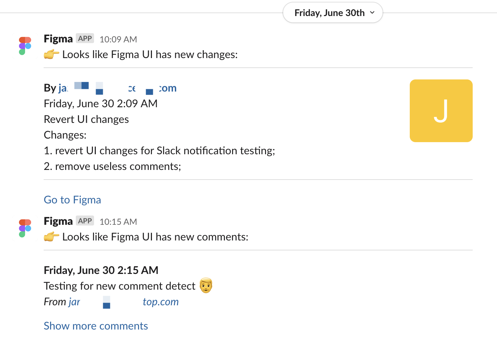
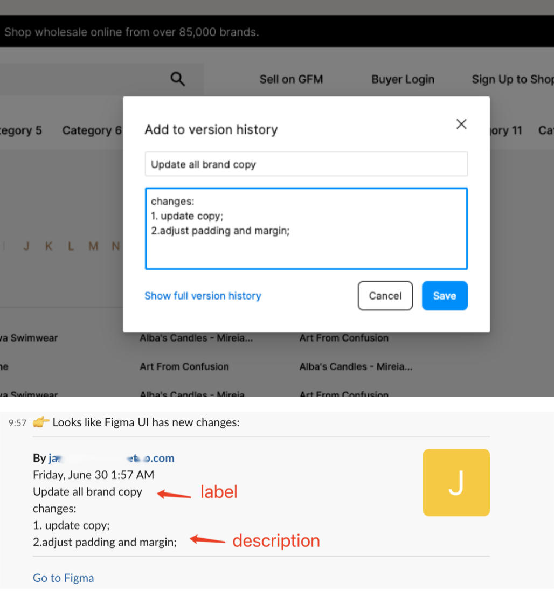
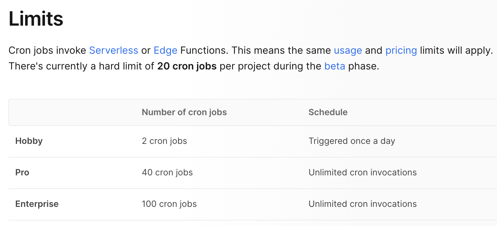
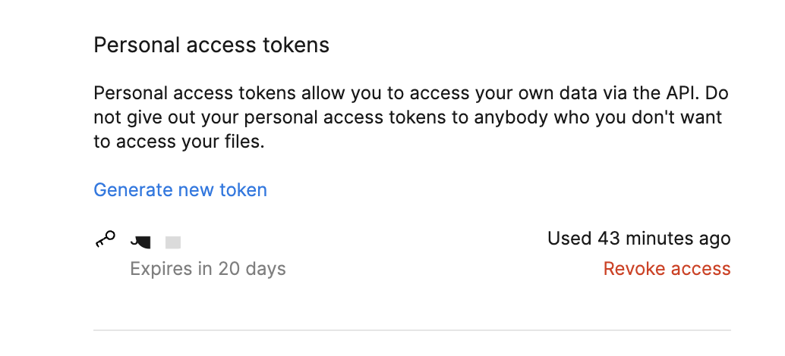
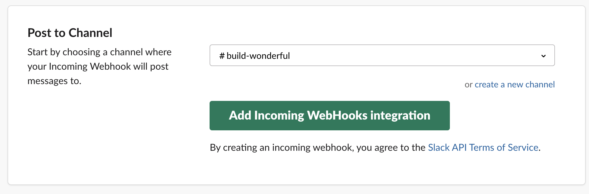
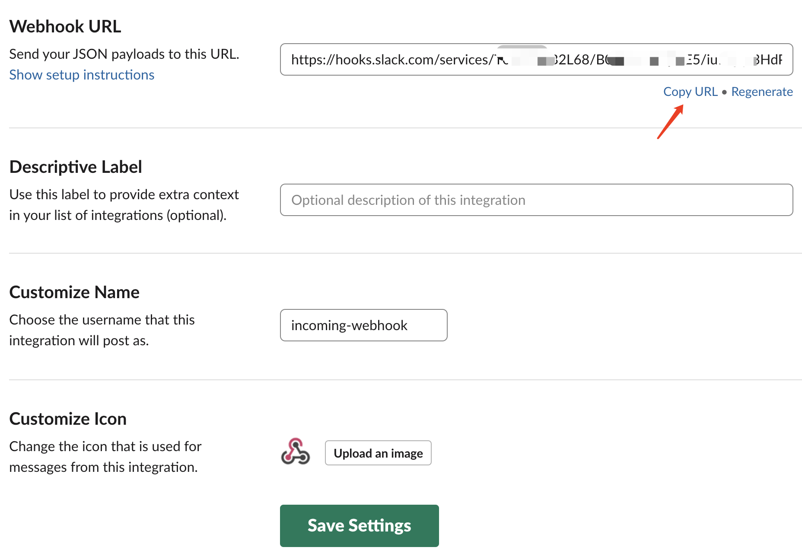
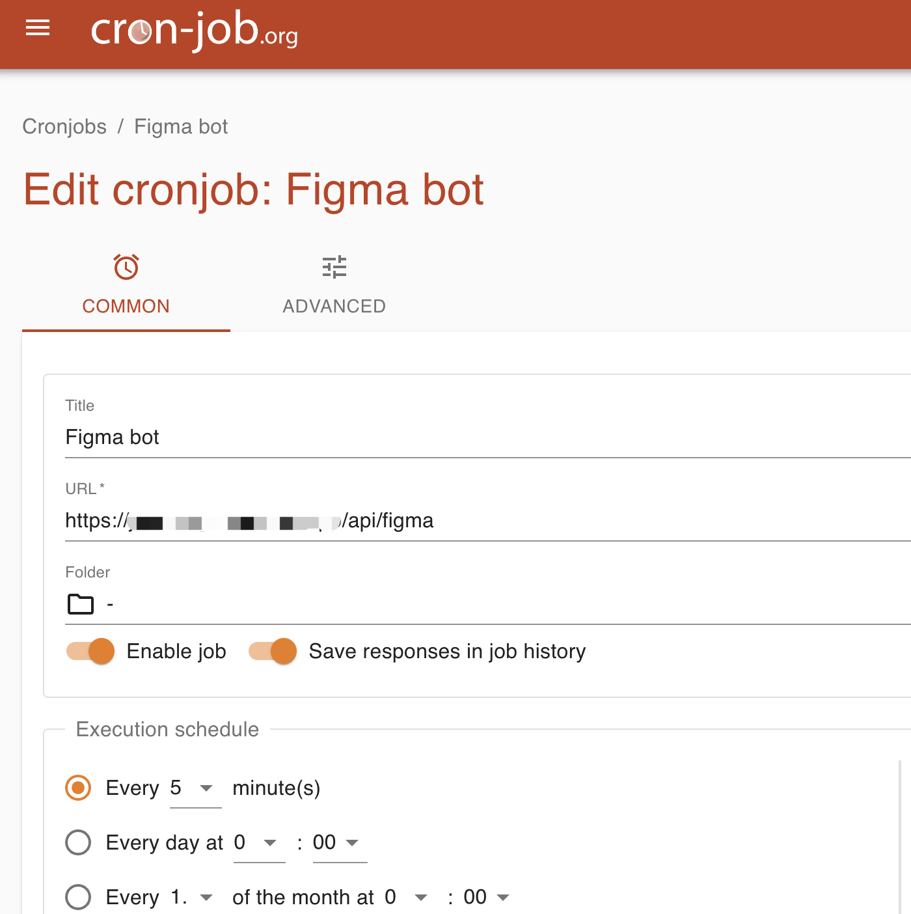

<h1 align="center">FigmaSync for Slack</h1>

<p align="center">Automatically send notifications to Slack when your Figma UI changed or there are new comments.</p>

## Example



## Setting up

- One click to deploy on Vercel in minutes  
  [](https://vercel.com/new/clone?repository-url=https%3A%2F%2Fgithub.com%2FJackZong%2FFigmaSync-for-Slack&env=FIGMA_TOKEN&env=FIGMA_FILE_ID&env=FIGMA_FILE_LINK&env=SLACK_WEBHOOK&env=FIGMA_COMMENT_LINK&project-name=FigmaSync-for-Slack&repository-name=FigmaSync-for-Slack)
- Set up app environment variable [env.local](#envlocal)
- After deploy, check bot runs well

  - `GET {your_app_url}/api/healthcheck` should returns `{status: 200,message: "success."}`
  - `POST {your_app_url}/api/figma` should returns `{status: 200,message: "initial data"}`
  - Then go to Figma try to make new comment or save new version history.
    Like this:
    

- Set up the cron job

_Note: we build our app with Next.js's serverless function and deploy it on Vercel by free. In free plan, we are able to set cron job by twice a day, so we need Vercel pro plan or set up the cron job to call API regular by ourself_


## env.local

set up the env.local and paste to vercel app environment variable

```js
FIGMA_TOKEN = xxx; // Figma Token
FIGMA_FILE_ID = xxx; // The Figma file ID which you want to listen
FIGMA_FILE_LINK = xxx; // The Figma file link which you are listening,like https://www.figma.com/file/[FIGMA_FILE_ID]/[FIGMA_FILE_NAME]
SLACK_WEBHOOK = xxx; // The Slack Incoming Webhooks url
FIGMA_COMMENT_LINK = xxx; // https://www.figma.com/file/[FIGMA_FILE_ID]?mode=design#{ID}
```

## About Figma

1. Get a `Personal Access Token`

   1. While logged into Figma on the web or the desktop app, visit your [Account Settings](https://www.figma.com/settings)
   2. Under **Personal Access Tokens**, click "Create a new personal access token"
   3. Name the the access token whatever you'd like, for example: `figma-slack-updates`
   4. Copy the token - this is your only chance to do so! This is your `FIGMA_TOKEN`
      

2. Get your file key

   Visit the Figma file that you'd like to post updates for and copy its `file key`. The file key can be found when you copy the file's link or visit the file on the web: figma.com/file/`file key`/... This is your `FIGMA_FILE_ID`

## About Slack

1. Get Slack webhook url

- Go to slack app gallery
- Add `Incoming WebHooks` to the channel which you want to push updates
  
- Copy the `Webhook Url`, this is your `SLACK_WEBHOOK`
  
- Also, you can custom a app name and app logo

_**Or:** you can create your own Slack app here => https://api.slack.com/apps_

## Cron job

two ways to set up cron job

- Vercel Pro user
- Find a tool by yourself

### Vercel Pro Trial

if you are vercel pro user, then you can use vercel's Corn job directly. Just add a vercel.json at root folder.

```json
{
  "crons": [
    {
      "path": "/api/figma",
      "schedule": "*/3 * * * *"
    }
  ]
}
// above means `/api/figma` will be called every 3 minutes, but you need change /api/figma/route.ts to GET function
```

More detail => https://vercel.com/docs/cron-jobs

### Find a tool by yourself

you can search for free cron job or deploy one by yourself

examples:

- Cron-job.Org(free)
  

## Reference

- Figma REST APIs => https://www.figma.com/developers/api
- Create Slack APP with Webhook feature => https://api.slack.com/apps

`Enjoy your bot. :)`
